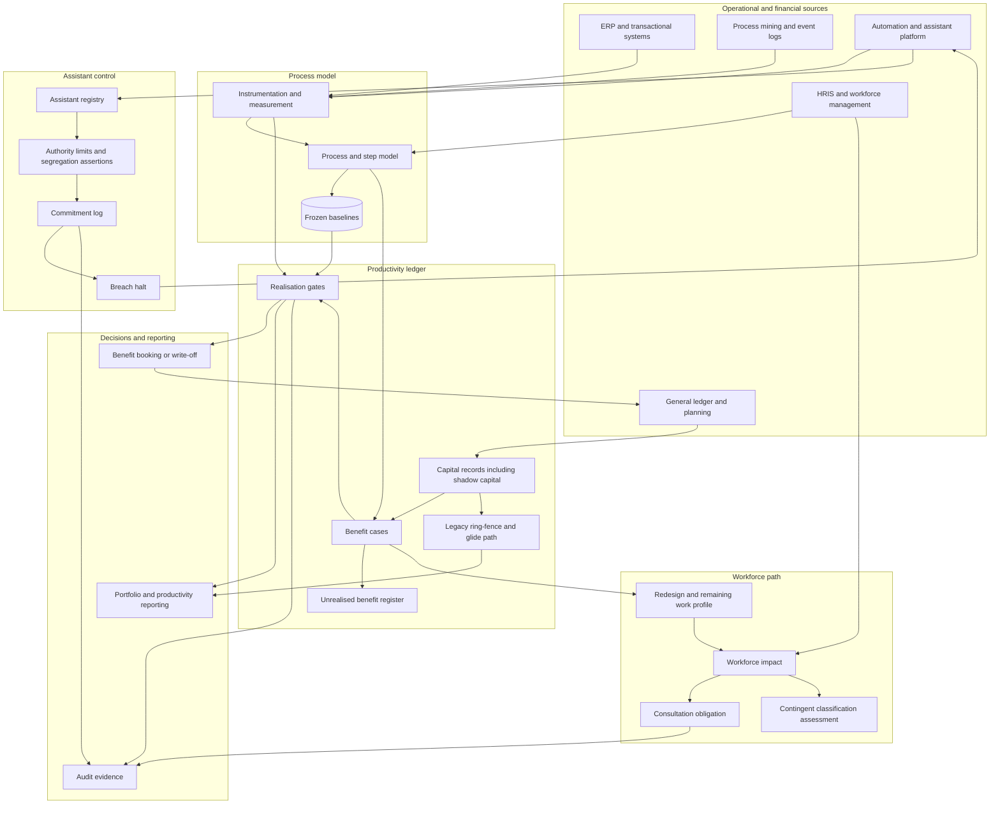

# Stepwright

**Source:** `ai-in-hr/Accenture-Productivity-Emergence-AI-Workforce/`
**Domain:** `ai-hr`
**One-liner:** A productivity settlement ledger for the virtual workforce: it counts the work steps a process actually takes, gates every automation benefit claim until the step count and the labour hours fall for real, captures the shadow capital hidden in business-unit operating budgets, and holds the authority limits that decide what a digital assistant may commit on its own.
**Wedge:** The three occupational families the source sizes — analysts, clerks, and sales and customer service representatives — inside the shared-services and commercial-operations functions of a 5,000-plus-employee enterprise, instrumented on the ten highest-volume end-to-end processes in finance operations and order-to-cash.
**Positioning:** Benefit realisation infrastructure for automation spend. Process mining tells you what the process looks like; the automation platform tells you how many times the bot ran; the business case told the board what the saving would be. Nothing reconciles the three, which is why enterprises can hold a portfolio of successful automations and a flat productivity line at the same time. Stepwright is the reconciliation.

## Market research synthesis

### Thesis from source

The source opens on the productivity paradox and quantifies it. Between 1900 and 1970 labour productivity and total factor productivity grew at more than two percent a year, weekly hours fell from 60 to 40 and life expectancy rose from the mid-50s to 70 as businesses absorbed steam, electricity, internal combustion and electronics. The last fifty years, despite smartphones, fast internet and ecommerce, have averaged around one percent, with a five-year mini-boom from 1999 driven by ERP systems, ATMs, bar code scanners and EDI — and in 2016 productivity actually fell. It quotes Solow's 1987 line that "you can see the computer age everywhere but in the productivity statistics" and Gordon's 2016 argument that a decade of information technology has not made the economy or labour much more productive.

Its diagnosis is where the product comes from, because each cause is an accounting failure as much as a technology one. First, innovation is genuinely harder: where a chip maker once needed 10 researchers to maintain Moore's law, by 1995 it took about 20 and now nearly 80 — eight times the input for the same growth rate. Second, and most usefully, information technology spending effectiveness is declining: the United States invests more than $500 billion in IT, about three percent of GDP, and the document notes this figure is *understated* because it excludes "the billions of shadow CAPEX hidden in business unit operating expenses," while "as many as 50 percent of IT projects are not successful." Third, allocation: since 2002 roughly $250 billion, nearly half of all venture investment, went into internet and telecommunications, and the wireless industry spent hundreds of billions on spectrum and equipment only to see 80 percent of IP network usage consumed by online video. Fourth, firms took the easier route to returns through outsourcing, offshoring and M&A rather than through productivity.

Against that, the source argues the next wave is different because it expands what an individual worker can do. Analysis of Bureau of Labor Statistics data leads it to claim that AI, machine learning and design thinking will transform at least 25% of US jobs over the next decade, and it sizes the most affected populations precisely: 2.6 million analysts, 14.3 million clerks, and 11.4 million sales and customer service representatives, plus 2.7 million commercial truck, bus and taxi drivers exposed to autonomous vehicles. It notes FAA figures showing commercial drones already outnumbering helicopters fourfold and growing from 42,000 in 2016 to a projected 442,000 in 2021. It cites Accenture research suggesting labour productivity could increase by 40 percent in 2035, and reports that customer- and frontline-driven design can eliminate up to 50 percent of work steps while increasing satisfaction. Its closing instruction to executives is blunt: ring-fence the old and drive the new, explore how any asset — capital or labour — can do three times the work it does today, and rather than reducing process runtime by 50 percent, strive to make it instant.

Two details in the source's own illustration carry more weight than its headline numbers. The digital assistant example — "Alexa, correlate Saturday ice cream sales with temperature and plot on a map, send to Brenda if interesting" — ends with the line that Brenda "doesn't even have to read the report; instead, her bot changes weekend pricing when it's expected to rain." That is not a reporting assistant; that is an assistant with commitment authority over price, executed without human review. And the source's claim that up to 50 percent of work steps can be eliminated sets the unit of measurement: the step, not the full-time equivalent. Put those together with the shadow-CAPEX and 50-percent-project-failure observations and the product writes itself as a ledger with three hard properties: work is measured in steps and hours rather than headcount; a benefit may not be booked until the measurement confirms it; and every assistant that can commit the enterprise to something carries a recorded authority limit, a reversibility rule and an audit trail.

### Buyer & economic model

- **Primary buyer:** the CFO and the COO jointly. The source is written for finance leaders "saddled with technical debt," and the purchase decision is a finance-control decision — how automation benefits are booked and how capital is ring-fenced — with operations owning the process instrumentation.
- **Users:** process owners and operations managers (daily), automation centre-of-excellence leads (deployment and throttling), finance business partners and benefit-realisation analysts (gates and booking), workforce planners and HR business partners (role mix and consultation effects), internal audit and controls owners (assistant authority and segregation of duties), and the front-line workers whose steps are being counted.
- **Budget owner / value metric:** the enterprise productivity or transformation programme, with the ring-fenced legacy run-cost budget as the second lever. The value metric is cost per unit of work output and steps per completed transaction, measured against total invested capital including the shadow capital the source says is missing from the official figure.
- **Competing status quo:** an automation centre of excellence reporting bot runs and "hours saved" from standard-time assumptions, a process mining licence with no link to the benefit case, business cases and benefit trackers in spreadsheets owned by whoever built them, an annual productivity target set top-down in the budget, and a capitalisation argument between finance and IT that nobody resolves with evidence.

### Domain constraints

- **Regulatory / trust / safety:** eliminating work steps changes jobs, and in most European jurisdictions a material change to work organisation or a headcount consequence triggers information and consultation duties before implementation. Step-level telemetry is employee monitoring and is subject to purpose limitation and proportionality tests. Assistants with commitment authority — changing a price, releasing a payment, issuing a credit, adjusting a shift — sit squarely inside financial-control frameworks and require segregation of duties, authority limits and reversibility. Shifting eliminated work to contingent or platform labour creates co-employment and worker-classification exposure that must be visible in the plan rather than discovered in litigation. Autonomous physical assets of the kind the source describes bring safety and airspace regimes of their own.
- **Data sensitivity:** the ledger joins operational telemetry to labour cost, which makes it commercially sensitive and individually sensitive at the same time. Step measurement must resolve at process and team level for management reporting; individual step data has a narrow legitimate purpose in work design and none in performance management. Benefit cases contain headcount consequences before they are announced, so access has to be tightly held ahead of consultation.
- **Change-management realities:** the people who sponsor an automation are the people whose benefit claim the gate will refuse, so the gate must be owned by finance rather than by the programme. Process owners will resist step instrumentation that looks like a time-and-motion study, which is why the measurement unit is the step rather than the person. And the source's own 50-percent project failure figure is the commercial argument: an enterprise that cannot tell which half of its automation portfolio worked is buying the next round blind.

## Business requirements

- BR-1: Work must be measured in process steps and labour hours per completed transaction, with a dated baseline per process, because headcount is a lagging and politically negotiated number while steps are countable.
- BR-2: No automation or assistant deployment may book a productivity benefit until a realisation gate confirms that the step count and labour hours per transaction have fallen against baseline for a defined sustained period; forecast benefits must be held as unrealised until then.
- BR-3: Every benefit case must record total invested capital including shadow capital — the automation, data, integration and change effort funded from business-unit operating budgets — so that return is measured against what was actually spent rather than against the capitalised subset.
- BR-4: Legacy run-cost must be ring-fenced and reported separately from new capability spend, with a stated glide path, so that "pivot hard and drive the new" is an enforced budget structure rather than an aspiration.
- BR-5: Every digital assistant permitted to commit the enterprise to an action must carry a recorded authority limit, a reversibility rule, a named human accountable owner, and a segregation-of-duties assertion; assistants may report without a limit but may not commit without one.
- BR-6: Assistant-initiated commitments must be logged with the instruction that produced them, the limit they were tested against, and their reversal status, and any breach of limit must halt the assistant automatically rather than after review.
- BR-7: Process redesign proposals must state the human work that remains and its composition, so that step elimination produces a designed role rather than a residue, and so the affected population is identified before implementation.
- BR-8: Where step elimination has a headcount or material work-organisation consequence, the consultation obligation must be raised and satisfied before deployment, with the workforce impact recorded as part of the benefit case rather than as a separate exercise.
- BR-9: Step-level telemetry must be used for work design and benefit verification only, aggregated at process and team level for management reporting, and excluded from individual performance and disciplinary processes.
- BR-10: Portfolio reporting must show realised against forecast benefit for every deployment, including failures, so that the enterprise can state which share of its automation portfolio delivered — the question the source's 50-percent project failure figure makes unavoidable.
- BR-11: Any proposal to move eliminated work to contingent, outsourced or platform labour must record the classification and co-employment assessment for that arrangement before the work moves.
- BR-12: Benefit cases, gate decisions, capital records, assistant authority limits and commitment logs must be retained for the audit and statutory reporting period, with an append-only history, since these records support both financial assertions and employment decisions.

## User stories

Canonical user stories live in sibling [USER_STORIES.md](USER_STORIES.md).

## System design

### Overview

Stepwright models the enterprise as a set of processes, each decomposed into steps with an owner, a system, a labour class and a measured time. Instrumentation feeds step-level event data from the underlying transactional systems and, where necessary, from lightweight operational timing, producing steps-per-transaction and hours-per-transaction series with a frozen baseline. Any change — an automation, an assistant, or a pure redesign — is registered as a deployment with a benefit case that states its forecast step and hour reduction, its total invested capital including shadow capital, and its workforce and consultation consequence. After go-live the deployment enters a measurement window; a realisation gate compares measured against forecast over a sustained period and either releases the benefit for booking, defers it, or fails it. In parallel, assistants that can commit the enterprise to an action are registered with authority limits, reversibility rules and segregation-of-duties assertions, and every commitment they make is logged and tested against the limit, with automatic halt on breach. The ledger then reports two things the enterprise cannot currently produce: cost per unit of work output against total invested capital, and the realised share of the automation portfolio.

### Actors & boundaries

- **Actors:** process owner, operations manager, automation centre-of-excellence lead, finance business partner, benefit realisation analyst, internal audit and controls owner, workforce planner, HR business partner, employee representative, and the digital assistant itself as a registered actor with an accountable human owner.
- **Trust boundary:** step telemetry resolves at process and team level for all management surfaces, with individual-level detail confined to a restricted work-design zone and blocked at the API boundary from performance and payroll systems. Benefit cases carrying unannounced headcount consequences are held in a restricted state visible only to the finance, HR and consultation roles until the obligation is discharged. Assistants operate strictly inside their registered limits; the commitment log is append-only and readable by audit independently of the process owner.
- **Human-in-the-loop points:** baseline freeze approval; benefit case approval; realisation gate decision, which is a finance decision rather than a programme one; assistant authority limit grant and periodic recertification; reversal of an assistant commitment; consultation raise and discharge before deployment; classification assessment sign-off before work moves to contingent labour.

### Core capabilities

1. **Process and step modelling** — decomposition of end-to-end processes into steps with owner, system, labour class, rework flag and measured time.
2. **Instrumentation and baselining** — event ingestion from transactional systems into steps-per-transaction and hours-per-transaction series, with frozen, dated baselines.
3. **Benefit case management** — forecast step and hour reduction, total invested capital with shadow capital capture, workforce consequence, and unrealised benefit tracking.
4. **Realisation gating** — sustained-period comparison of measured against forecast, with release, defer or fail outcomes and automatic re-measurement.
5. **Assistant registry and authority control** — registration of assistants, authority limits, reversibility rules, segregation-of-duties assertions, and recertification.
6. **Commitment logging and enforcement** — append-only log of assistant-initiated commitments with limit testing, breach halting, and reversal tracking.
7. **Capital and ring-fence management** — separation of legacy run-cost from new capability spend with a glide path and variance reporting.
8. **Workforce impact and consultation** — identification of affected populations, role-mix consequences, consultation raising and discharge, and contingent-labour classification assessment.
9. **Portfolio and productivity reporting** — cost per unit of work output, realised versus forecast benefit including failures, and step-elimination performance against the source's up-to-50-percent reference point.
10. **Audit and retention** — append-only history of cases, gates, capital records, limits and commitments for financial and employment audit.

### Conceptual data

- **Primary entities:** Process, ProcessStep, WorkUnit, TelemetryStream, StepMeasurement, Baseline, Deployment, BenefitCase, CapitalRecord, ShadowCapitalEntry, RealisationGate, GateDecision, UnrealisedBenefit, Assistant, AuthorityLimit, SegregationAssertion, CommitmentEvent, ReversalRecord, RedesignProposal, RemainingWorkProfile, WorkforceImpact, ConsultationObligation, ContingentClassificationAssessment, RingfenceBudget, ProductivityIndex.
- **Critical events:** baseline frozen; benefit case approved; deployment went live; measurement window opened and closed; gate passed, deferred or failed; benefit booked or written off; shadow capital entry recorded; assistant registered, limit granted, limit breached, assistant halted; commitment made and reversed; consultation raised and discharged; work reclassified to contingent labour; ring-fence variance breached.
- **Retention / audit needs:** benefit cases, gate decisions, capital records and commitment logs retained for the financial audit and statutory reporting period with an append-only history, since they support booked benefits and control assertions. Workforce impact records and consultation evidence retained for the employment-claim limitation period. Individual step telemetry held on a short window and aggregated thereafter; aggregated series retained long enough to preserve baselines and trend comparability.

### Integrations (conceptual)

- **Systems of record:** the general ledger and financial planning system for benefit booking, capital and ring-fence budgets; the ERP and order-to-cash, procure-to-pay and service management systems that generate step events; the HRIS and workforce management systems for labour class, cost per hour and affected populations; the contingent workforce or vendor management system.
- **Upstream signals:** process mining outputs and event logs, automation and assistant platform telemetry with instruction records, contact centre and case system handling data, project and change portfolio data for capital and effort, and business-unit operating expenditure detail from which shadow capital is identified.
- **Downstream actions:** benefit release or write-off entries to finance, throttle or halt instructions to the automation and assistant platforms on limit breach, redesign proposals and remaining-work profiles to process owners and HR, consultation raising to employee representatives, role-mix updates to workforce planning, and audit evidence packages to internal audit.

### High-level architecture

Measurement flows one way into the ledger; money and authority flow only after a gate. The assistant control path is deliberately separate from the benefit path, because a commitment breach must be able to halt an assistant without waiting for anyone's benefit case.

### Success metrics

- **Leading:** share of in-scope processes with a frozen baseline and live step instrumentation; share of deployments with an approved benefit case including shadow capital before go-live; median days from go-live to gate decision; share of assistants with commitment authority carrying a current authority limit and segregation assertion; limit breaches detected and halted automatically; consultation obligations raised before rather than after deployment.
- **Lagging:** steps per completed transaction and labour hours per completed transaction against baseline, against the source's up-to-50-percent step elimination reference; cost per unit of work output against total invested capital including shadow capital; realised benefit as a share of forecast benefit across the portfolio, and the share of deployments that failed their gate, read against the source's claim that up to half of IT projects are unsuccessful; ring-fenced legacy run-cost as a share of total spend against the glide path; rework and reconciliation step share; role-mix shift across the analyst, clerk and service-representative populations; assistant commitment reversal rate and control findings attributable to assistant authority.

## OpenAPI skeleton

Canonical HTTP surface lives in sibling [openapi.yaml](openapi.yaml). Summary:

- **Base path:** `/v1/...`
- **Auth:** `X-API-Key` for telemetry ingestion from ERP, process mining and automation platforms; Bearer JWT for process owner, finance, audit, HR and centre-of-excellence sessions with scope-restricted claims.
- **Resource groups:** Processes, Instrumentation, Benefit Cases, Gates, Capital, Assistants, Commitments, Workforce Impact, Reporting.
