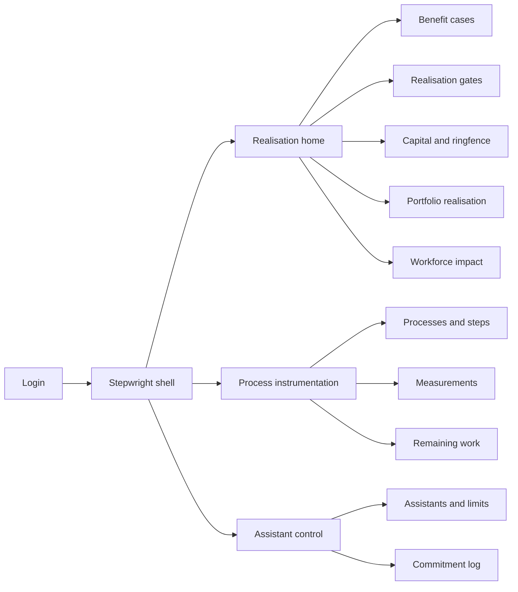
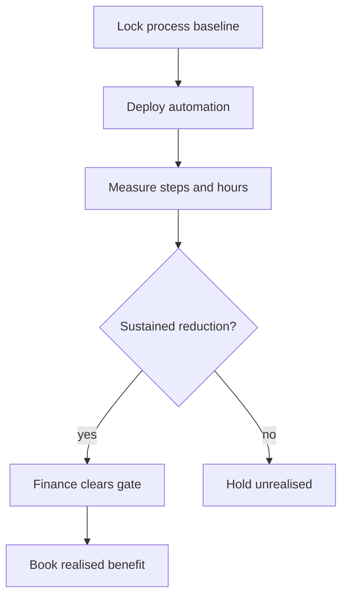
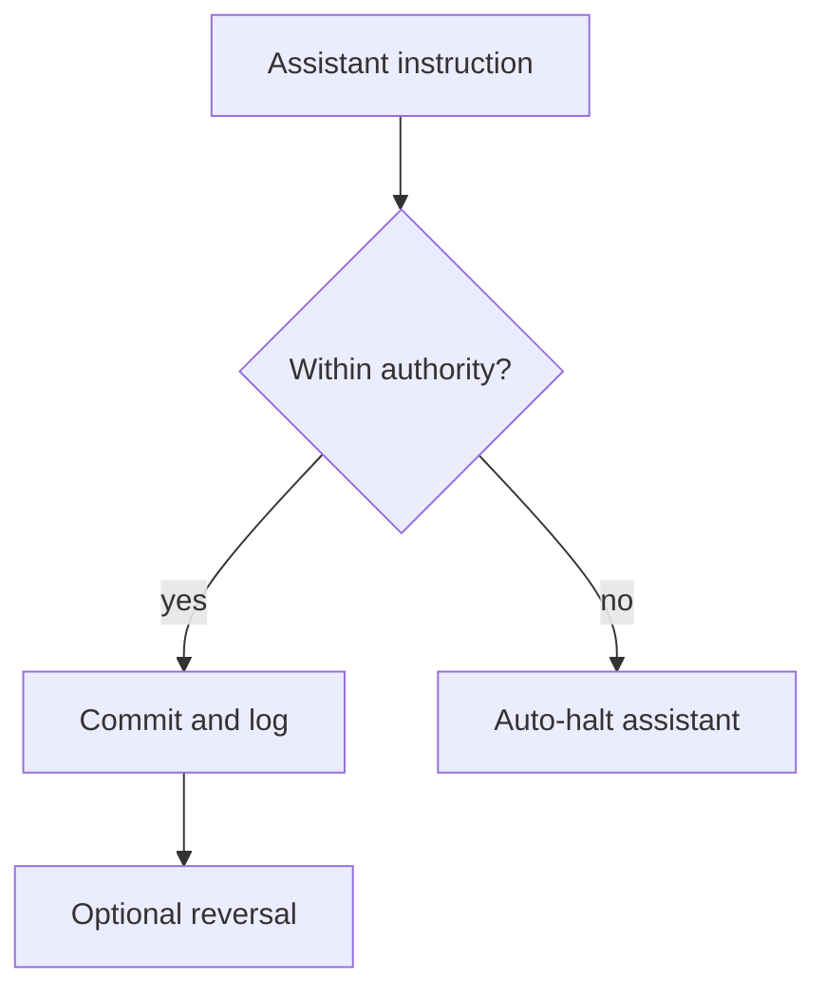

# Stepwright — Web app

**Product:** [PRODUCT.md](./PRODUCT.md)
**Primary surface:** Productivity settlement console (CFO/COO benefit-realisation workspace)
**Secondary surfaces:** Assistant authority control room; process-owner instrumentation view
**Design thesis:** Stepwright is a clearing house for automation benefits — not a bot-run vanity dashboard. The UI metaphor is a settlement blotter: every claimed hour saved sits as unrealised until steps-per-transaction and labour hours clear a realisation gate against a dated baseline; shadow capital is itemised like off-balance spend brought into the light; digital assistants that can commit the firm show authority limits like trading desks. Visual language is cool graphite and settlement-green on a deep slate ground — booked benefits feel final; unrealised claims feel provisional amber; authority breaches halt in coral. The brand wordmark sits as a quiet mint mark on every gate decision and commitment log so finance and audit know whose ledger they are reconciling.

## UX research synthesis

### Category peers (best-in-class)

- **Celonis / UiPath Process Mining:** Step-level process graphs and throughput times. Steal: steps-per-case as the primary unit; reject “hours saved” tiles computed from standard times without sustained measurement.
- **Apptio / FinOps cloud cost:** Total cost of ownership including shadow IT. Steal: capitalisation of business-unit opex as first-class spend; reject CapEx-only ROI that ignores shadow capital (BR-3).
- **Workday Adaptive / Anaplan benefit trackers:** Gate workflows before booking. Steal: finance-owned realisation gates; reject programme-owned self-certification of savings.
- **UiPath / Automation Anywhere CoE portals:** Bot inventory and run counts. Steal: deployment registry; reject treating run count as benefit realisation.

### Patterns to adopt / reject

- **Adopt:** Baseline steps and hours per transaction; unrealised vs realised benefit states; shadow capital on every case; legacy ring-fence vs new capability; assistant authority limits with auto-halt on breach; remaining-work design before deploy; consultation flag on workforce impact; portfolio including failures.
- **Reject:** Bot-run KPIs as home; purple “AI productivity” glow; individual step heatmaps for managers; editable booked benefits; headcount-first measurement; approve-all benefit claims.

### Trust, density, and workflow constraints from PRODUCT.md

Benefits cannot book until the gate confirms sustained step and hour reduction (BR-2). Shadow capital must be in the denominator (BR-3). Legacy run-cost is ring-fenced (BR-4). Assistants that commit need limits, reversibility, owner, SoD (BR-5–6). Step telemetry is work-design only, not performance (BR-9). Consultation before material deployment (BR-8). Contingent labour moves need classification assessment (BR-11). Audit retention on gates and commitments (BR-12).

## Information architecture

### Nav model

### Roles → default home

| Role | Default home | Why |
|------|--------------|-----|
| CFO / finance BP / benefit analyst | Realisation home — unrealised queue | Own the gate (BR-2) |
| COO / process owner | Process instrumentation | Steps and hours baseline (BR-1) |
| Automation CoE lead | Deployments + assistants | Limits before commit authority (BR-5) |
| Internal audit / controls | Commitment log + breaches | Auto-halt evidence (BR-6) |
| HR / workforce planner | Workforce impact | Consultation before deploy (BR-8) |
| Front-line team lead | Remaining work design | Designed role, not residue (BR-7) |

### Cross-links to OpenAPI resources

| Nav area | OpenAPI tags / resources |
|----------|---------------------------|
| Processes, steps, baseline | Processes |
| Measurements | Instrumentation |
| Deployments, benefit cases, unrealised | BenefitCases |
| Gates | Gates |
| Capital records, ringfence | Capital |
| Assistants, authority limits | Assistants |
| Commitments, reversals | Commitments |
| Remaining work, workforce impact, contingent | WorkforceImpact |
| Portfolio realisation, productivity index | Reporting |

## Screen inventory

### Realisation home

- **Purpose:** Answer “how much claimed benefit is still unrealised, and which gates are ready to clear?” in one composition.
- **Entry:** Finance login default.
- **Layout regions:** Brand + programme scope; unrealised vs realised strip; gate-ready queue; portfolio failure share; alerts (authority breaches, consultation pending).
- **Primary actions:** Open gate; hold benefit; jump to breached assistant.
- **Empty / loading / error:** Empty = no deployments instrumented; loading = skeleton strips.
- **BR / story ties:** BR-2, BR-10.

### Processes and step inventory

- **Purpose:** Define end-to-end process, named steps, and dated baseline for steps and labour hours per completed transaction.
- **Entry:** Process nav; CoE attach deployment.
- **Layout regions:** Process list; step graph; baseline editor; team-level aggregates only.
- **Primary actions:** Set baseline; lock baseline version; open measurements.
- **Empty / loading / error:** No baseline = block benefit case create.
- **BR / story ties:** BR-1, BR-9.

### Measurements

- **Purpose:** Show sustained movement in steps and hours vs baseline for gate evidence.
- **Entry:** Process detail; gate review.
- **Layout regions:** Time series; sustained-period highlighter; variance narrative; purpose-limitation seal.
- **Primary actions:** Mark gate-ready; export for finance.
- **Empty / loading / error:** Insufficient period = not gate-ready.
- **BR / story ties:** BR-1, BR-2.

### Benefit case

- **Purpose:** Capture forecast benefit, shadow capital, workforce impact flags, and hold unrealised until gate.
- **Entry:** Deployment create; finance case list.
- **Layout regions:** Forecast vs realised; capital including shadow lines; consultation status; contingent assessment link; append-only decision trail.
- **Primary actions:** Submit for gate; revise forecast; attach capital.
- **Empty / loading / error:** Missing shadow capital = validation block.
- **BR / story ties:** BR-2, BR-3, BR-8, BR-11.

### Realisation gate

- **Purpose:** Finance-owned clear/hold: confirm step and hour reduction for sustained period before booking.
- **Entry:** Home queue; benefit case.
- **Layout regions:** Evidence panes (steps, hours); capital denominator; workforce consultation checklist; clear/hold with reasons.
- **Primary actions:** Clear to realised; hold as unrealised; request more measurement.
- **Empty / loading / error:** Programme self-clear attempt = role deny.
- **BR / story ties:** BR-2.

### Capital and ringfence

- **Purpose:** Record total invested capital including shadow; separate legacy run-cost from new capability with glide path.
- **Entry:** Finance capital nav.
- **Layout regions:** Capital ledger; shadow opex lines; ringfence vs new spend; glide-path chart.
- **Primary actions:** Add capital record; adjust ringfence; export for board.
- **Empty / loading / error:** CapEx-only case flagged incomplete.
- **BR / story ties:** BR-3, BR-4.

### Assistant authority control

- **Purpose:** Register assistants that can commit; set authority limits, reversibility, owner, SoD; distinguish report-only vs commit.
- **Entry:** Controls / CoE.
- **Layout regions:** Assistant inventory; limit editor; SoD assertion; halt status.
- **Primary actions:** Set limits; assign owner; halt/resume.
- **Empty / loading / error:** Commit-capable without limit = coral block.
- **BR / story ties:** BR-5.

### Commitment log

- **Purpose:** Append-only log of assistant commitments: instruction, limit tested, reversal status; auto-halt on breach.
- **Entry:** Audit home; assistant detail.
- **Layout regions:** Commitment table; breach rail; reversal actions; instruction replay.
- **Primary actions:** Reverse; investigate breach; confirm auto-halt.
- **Empty / loading / error:** Breach without halt = integrity alarm.
- **BR / story ties:** BR-6.

### Remaining work design

- **Purpose:** State human work that remains after step elimination — designed role, not residue; identify affected population.
- **Entry:** Pre-deploy checklist.
- **Layout regions:** Eliminated vs remaining steps; role composition; population list (restricted pre-consultation).
- **Primary actions:** Approve remaining-work design; link to workforce impact.
- **Empty / loading / error:** Deploy without remaining-work = block.
- **BR / story ties:** BR-7.

### Workforce impact and consultation

- **Purpose:** Raise consultation when headcount or work-organisation consequence exists; record as part of benefit case.
- **Entry:** Benefit case; HR home.
- **Layout regions:** Impact summary; consultation checklist; contingent classification assessment.
- **Primary actions:** Mark consultation satisfied; record contingent assessment; block deploy if open.
- **Empty / loading / error:** Open obligation = deploy blocked.
- **BR / story ties:** BR-8, BR-11.

### Portfolio realisation report

- **Purpose:** Show realised vs forecast for every deployment including failures — answer the 50% failure question.
- **Entry:** Leadership reporting.
- **Layout regions:** Portfolio table; failure share; productivity index; capital-adjusted return.
- **Primary actions:** Export board pack; filter failures.
- **Empty / loading / error:** Hidden failures = integrity warning if filtered by default.
- **BR / story ties:** BR-10.

## Key flows

1. **Book a benefit** — baseline → deploy → measure sustained period → finance gate → realised; failure: hold as unrealised (BR-2).

2. **Assistant commit with limit** — instruction → test authority limit → commit or auto-halt → log → reverse if needed (BR-5, BR-6).

3. **Shadow capital true ROI** — capture BU opex shadow lines → include in capital record → gate uses full denominator (BR-3).

4. **Consultation before deploy** — remaining-work + headcount impact → consultation → only then deploy (BR-7, BR-8).

5. **Portfolio honesty** — include failed deployments in realised-vs-forecast report (BR-10).

## Design system

### Tokens (CSS variables)

- `--color-ink: #E8EEF2`
- `--color-ground: #0B1218`
- `--color-panel: #121C26`
- `--color-rule: #2A3A4A`
- `--color-mint: #3DDC97` — realised / settled benefit
- `--color-mint-dim: #1F6B4A`
- `--color-amber: #E6A23C` — unrealised / gate pending
- `--color-coral: #E85D4C` — authority breach / halt
- `--color-steel: #7A9BB0`
- `--color-brand: #9FD9C4` — Stepwright mark
- `--font-display: "IBM Plex Sans", sans-serif`
- `--font-mono: "IBM Plex Mono", monospace` — commitment ids, gate ids, capital lines
- `--space-1`…`--space-8`: 4px scale
- `--radius-sm: 4px`; `--radius-md: 8px`
- `--motion-settle: 180ms ease-out` — gate clear flash
- `--motion-unrealised: 240ms ease-in-out` — amber pulse on held benefits
- `--motion-halt: 160ms ease-in` — coral halt interrupt
- Atmosphere: horizontal ledger hairlines; soft top vignette; no stock “robots shaking hands” imagery.

### Typography & brand

- Display for KPI numerals and gate titles; mono for commitment and capital line ids.
- Brand mark on every gate, commitment, and portfolio money view.
- Login: brand hero; headline (“Benefits book when steps fall — not when bots run”); one CTA.

### Do / don’t

- **Do:** Hold unrealised until gate; show shadow capital; ring-fence legacy; auto-halt on limit breach; aggregate steps at process/team; include failures in portfolio.
- **Don’t:** Purple AI glow; bot-run home KPIs; individual productivity heatmaps; editable settled benefits; card grids of vanity savings.

### Accessibility & domain trust cues

- AA+ contrast; settled vs unrealised via lock + text.
- Live regions for halts and gate clears.
- Focus: baseline → measure → gate → book.
- Purpose-limitation seal on measurement views.

## Component patterns

- **UnrealisedBenefitRow** — forecast held until gate.
- **RealisationGatePanel** — dual evidence (steps + hours) + finance clear.
- **ShadowCapitalLine** — BU opex brought into denominator.
- **RingfenceGlidePath** — legacy vs new spend.
- **AuthorityLimitCard** — limit, reversibility, owner, SoD.
- **CommitmentLedgerRow** — instruction, limit test, reversal.
- **AssistantHaltBanner** — auto-halt on breach.
- **RemainingWorkDesign** — eliminated vs designed remaining steps.
- **PortfolioFailureShare** — realised vs forecast including fails.
- **PurposeLimitationSeal** — step data not for performance.

## Out of scope for v1 web

- Full process-mining engine replacement; RPA bot builders; ERP replacement; autonomous vehicle/drone ops; native mobile trader apps; employee performance modules (explicitly excluded).
